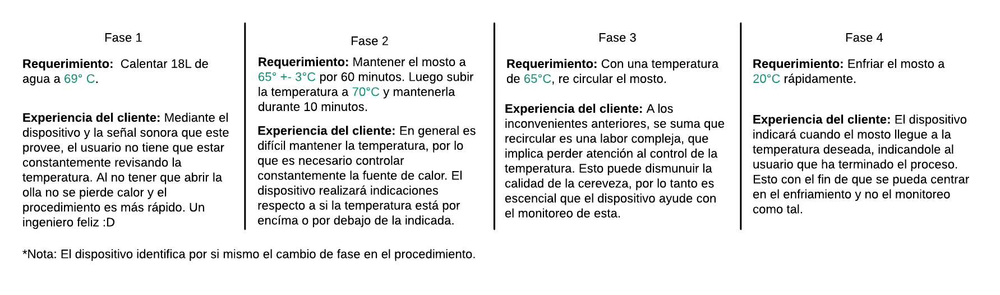
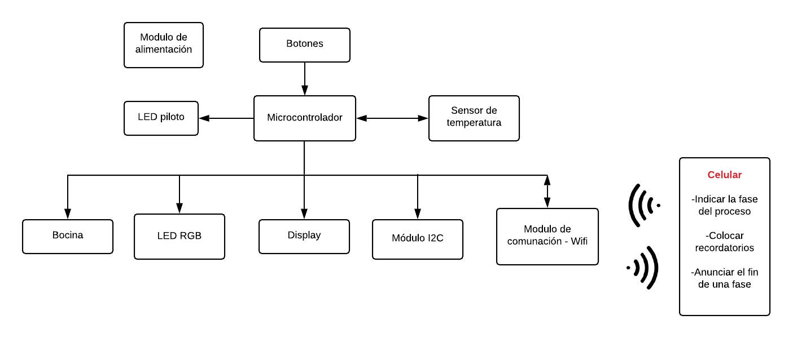
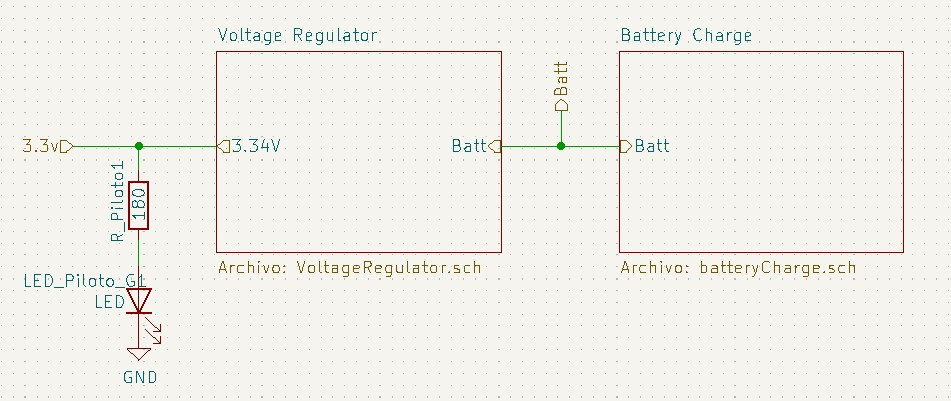
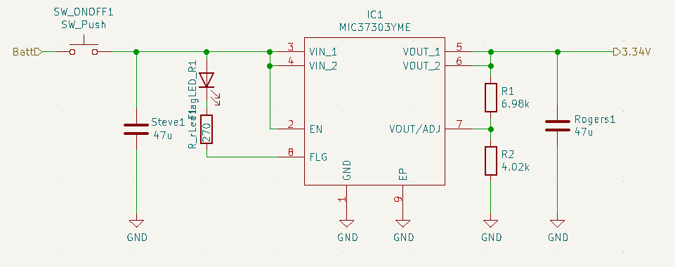
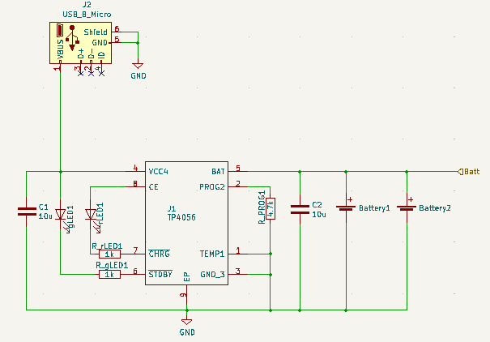
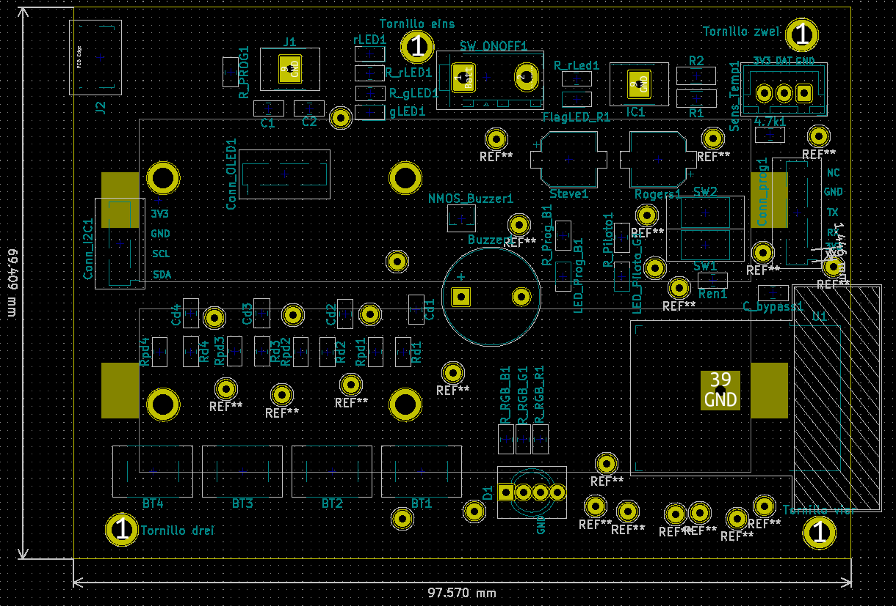
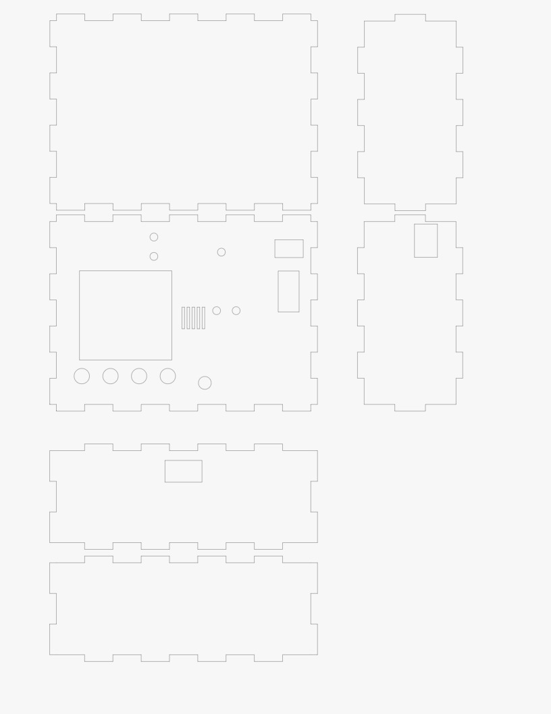
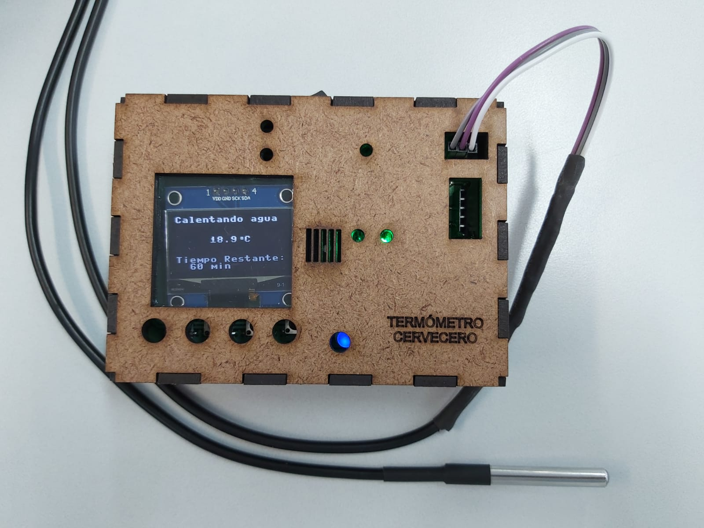

# RemoteTempMonitor
Device for temperature monitoring, focused on beer manufacture.

Dispositivo embebido enfocado a monitorear y guiar al usuario en la creación de cerveza. Se pretende que el dispositivo funcione como una herramienta de ayuda que pueda facilitar la toma de temperatura, y el subsecuente control de la misma en las fáses de calentamiento y enfriamiento del mosto.

## Descripción no funcional 

- Acoplarse adecuadamente al recipiente empleado.
- Comunicarse de manera inalámbrica via Wifi o bluetooth. 
- Tener una resolución de 1°C con incertidumbre de  0.5°C.
- Medir temperaturas entre: 0ºC a 120ºC. 
- Establecer conexiones a mínimo 10 m de distancia.
- Tener un tiempo de comunicación de 15s.

## Descripción funcional 

- Medir temperatura.
- Enviar la temperatura a un dispositivo móvil .
- Permitir la configuración de alarmas de temperatura.
- Disparar alarmas. 
- Mostrar temperatura en un display.

## Fases de la utilización del producto:

## Diagrama de bloques de la solución

## Dispositivos a emplear
A continuación se ve una lista resumida de los elementos más importantes a utilizar, con sus respectivos precios, cantidad y tienda sugerida, para una lista más detallada de todos los componentes puede ver el excel **Lista_componentes.xlsx**.

# Diseño de la pcb

## Zona de potencia
Como todo circuito electrónico, se requiere de una fuente de potencia para el funcionamiento del mismo. Para esto se planteó fos bloques principales, uno para la regulación de voltage que llega a la ESP32 y sus periféricos, y un bloque de carga para las baterías que alimentan el conjunto. Dichos bloques son:

## Regulador de Voltaje
Dado que la tensión que entregan las baterías de Litio es de 4.2V, es necesario agregar el integrado MIC37303YME, que permite entregar la tensión deseada de 3.3v a la entrada de la ESP32. El esquemático empleado es el siguiente:

## Cargador de Baterías 

Evidentemente las baterias empleadas requieren ser cargadas de vez en cuando para que el sistema funcione. Por ello se agregó el integrado TP4056 con el circuito de la imagen, para realizar esta operación y así mismo proveer de leds guía de cargado y descargado.

Para conveniencia del usuario, se decidió agregar un conector tipo micro-usb B como conector para realizar la carga del dispositivo. Además cuando el dispositivo está sin carga se indicará con un led rojo como se observa a continuación:

## Diseño de caja 

Con el fin de realizar un empaquetado para el termómetro, se realizó el diseño de una caja en madera con corte laser mediante el programa de CorelDraw. El objetivo es que esta  proteja el circuito del termómetro como tal, así como proveerle una mejor apariencia estética. 
Para el diseño se emplearon las medidas tomadas directamente del diseño obtenido de la pcb en Kicad:

Entonces se planea el diseño de tal forma de que haya cierta tolerancia a los tamaños reales de la plata. Se tienen en cuenta elementos que deben ser visibles al usuario como:

- Pantalla de interacción.
- Botonera.
- Puerto de carga USB.
- Led de indicación de bateria baja.
- Led de indicación de carga completa.
- Rejilla para el buzzer.

El resultado del diseño se encuentra en la sección **Box-Design**, donde se encuentran tanto los archivos generados en formatos .pdf y .svg (archivo de gráficos escalables), como el archivo original para ser abierto en el programa CorelDraw. La previsualización resulta:

## Dispositivo resultante 

Después de realizar la soldadura de los elementos en el circuito impreso, se añadieron así mismo los periféricos como la pantalla OLED, el Buzzer y la sonda de temperatura. El dispositivo físico final es el que se ve a continuación:

## Más detalles
Para más detalles del proyecto, vaya a cada una de las carpetas del proyecto y ahí verá información de lo que existe en cada carpeta.

