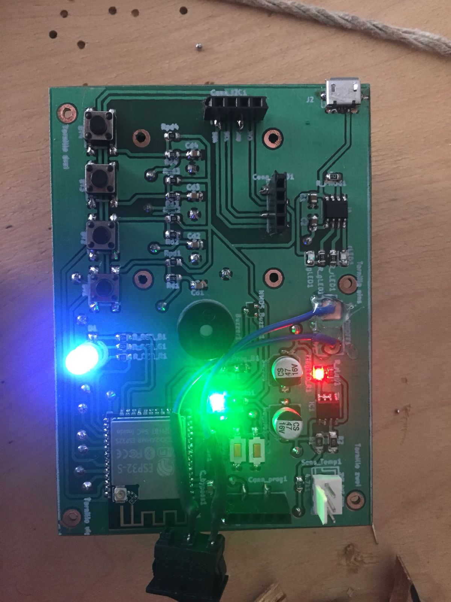
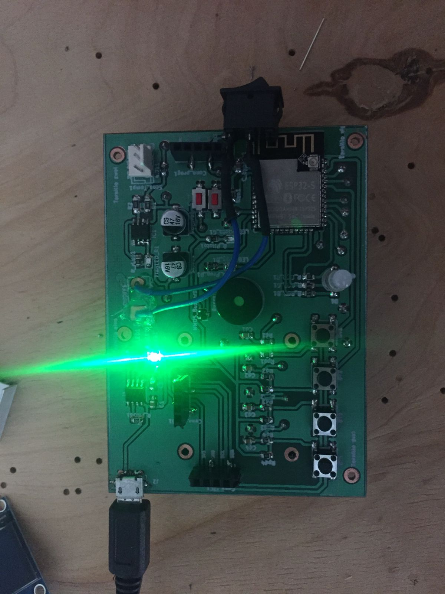
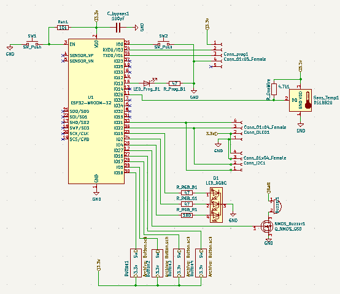
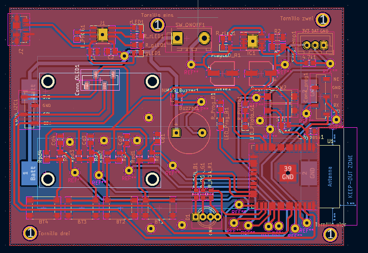
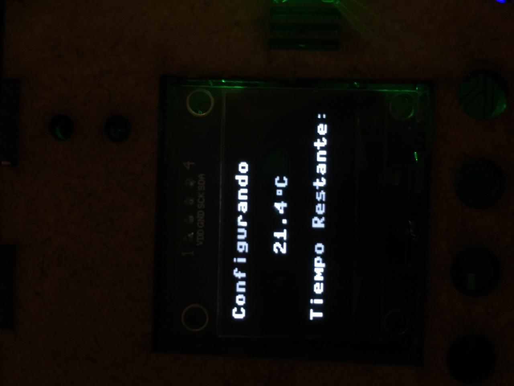
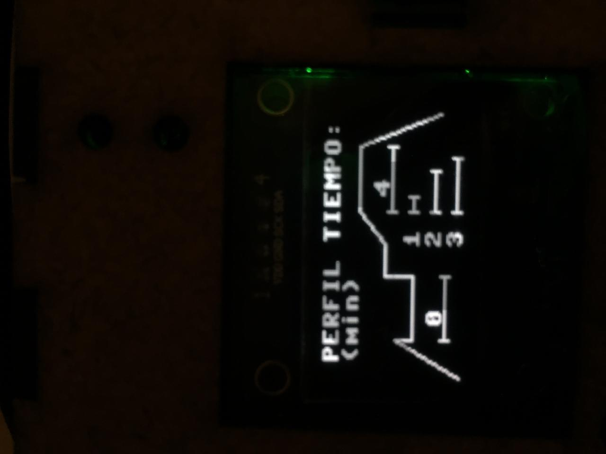
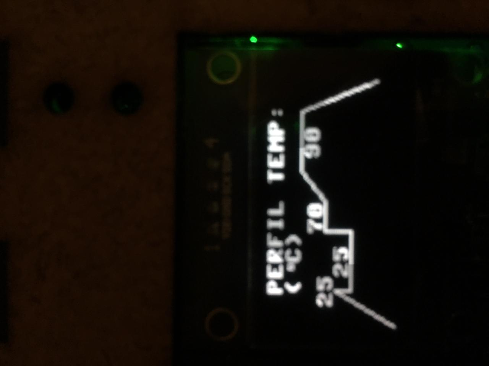
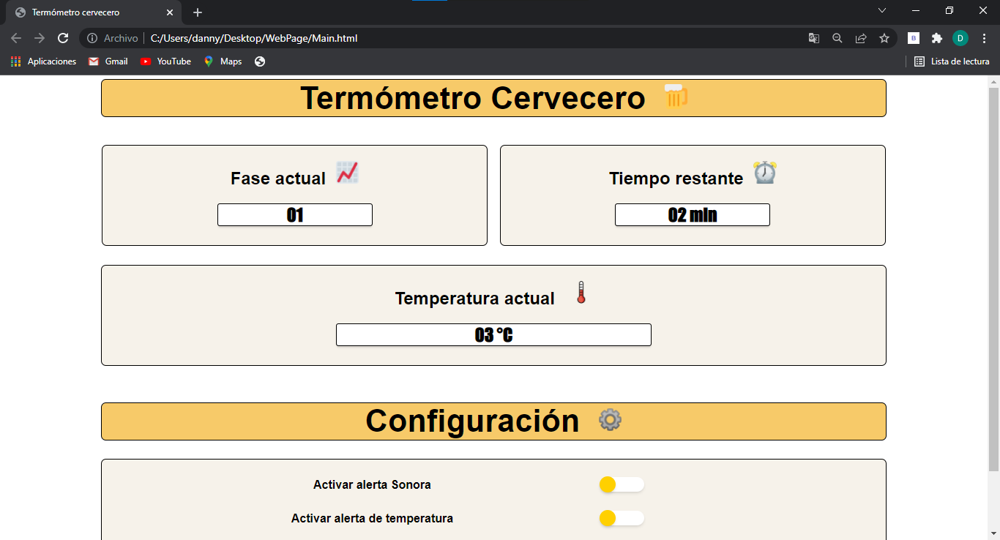
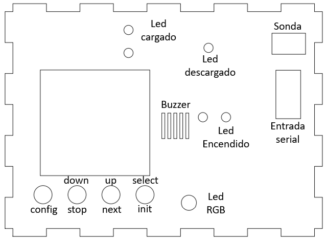

# RemoteTempMonitor :beers:

Dispositivo embebido enfocado a monitorear y guiar al usuario en la creación de cerveza. Se pretende que el dispositivo funcione como una herramienta de ayuda que pueda facilitar la toma de temperatura, y el subsecuente control de la misma en las fáses de calentamiento y enfriamiento del mosto.

## [Descripción no funcional](/CircuitDesign) 

- Acoplarse adecuadamente al recipiente empleado.
- Comunicarse de manera inalámbrica via Wifi o bluetooth. 
- Tener una resolución de 1°C con incertidumbre de  0.5°C.
- Medir temperaturas entre: 0ºC a 120ºC. 
- Establecer conexiones a mínimo 10 m de distancia.
- Tener un tiempo de comunicación de 15s.

## Descripción funcional 

- Medir temperatura.
- Enviar la temperatura a un dispositivo móvil .
- Permitir la configuración de alarmas de temperatura.
- Disparar alarmas. 
- Mostrar temperatura en un display.

## Fases de la utilización del producto:

## Diagrama de bloques de la solución

## Dispositivos a emplear
A continuación se ve una lista resumida de los elementos más importantes a utilizar, con sus respectivos precios, cantidad y tienda sugerida, para una lista más detallada de todos los componentes puede ver el excel **Lista_componentes.xlsx**.

# Diseño de la pcb

Para llevar a cabo el diseño del circuito embebido, se empleó el programa open source Kikad, donde todos los archivos generados se encuentran en la carpeta **CircuitDesign**, en donde se encuentran dos versiones de la placa. La primera empleando vias para conectar la cara superior con la inferior, que se ve en la carpeta **PCB_Design**. Sin embargo, debido a las limitaciones de tiempo y capacidades de realización fue necesario realizar una modificación cambiando las vias por conexiones mediante pines. Este segundo diseño se encuentra en **PCB_Design_Low_Cost**

## Zona de potencia
Como todo circuito electrónico, se requiere de una fuente de potencia para el funcionamiento del mismo. Para esto se planteó fos bloques principales, uno para la regulación de voltage que llega a la ESP32 y sus periféricos, y un bloque de carga para las baterías que alimentan el conjunto. Dichos bloques son:

  
## Regulador de Voltaje
Dado que la tensión que entregan las baterías de Litio es de 4.2V, es necesario agregar el integrado MIC37303YME, que permite entregar la tensión deseada de 3.3v a la entrada de la ESP32. El esquemático empleado es el siguiente:

## Cargador de Baterías 

Evidentemente las baterias empleadas requieren ser cargadas de vez en cuando para que el sistema funcione. Por ello se agregó el integrado TP4056 con el circuito de la imagen, para realizar esta operación y así mismo proveer de leds guía de cargado y descargado.

Para conveniencia del usuario, se decidió agregar un conector tipo micro-usb B como conector para realizar la carga del dispositivo. Además cuando el dispositivo está sin carga se indicará con un led rojo como se observa a continuación:

  
En caso de que se haya completado la carga, el indicador resultante es: 

## Esquemático ESP32

El microprocesador empleado para el proyecto es la ESP32 standalone, que posee una flexibilidad y robustez más que suficiente para los propócitos del mismo. Es posible emplear toda la gama de pines GPIO dependiendo de la necesidad, por ejemplo para lectura o escritura. El esquemático resultante es:

Es posible entonces realizar el diseño de la PCB y el ruteo de los caminos  para generar los archivos gerber y enviarlos a impresión en un local dedicado a esta labor. El sieño obtenido finalmente después de añadir además las conexiones entre capas es:

## Software del dispositivo 

Para poder programar el microprocesador ESP32 se optó por usar el lenguaje **MicroPython**, por su facilidad de sintaxis, versatilidad y cantidad de librerias disponibles para facilitar el proceso de codificación. Algunas de las librerías empleadas son:

- SH1106 (librería para controlar la pantalla OLED, extraida de: https://github.com/robert-hh/SH1106)
- DS18B20 (librería para controlar la sonda de temperatura, ya presente en Micropython)

Para ver en detalle el código empleado para el funcionamiento del termómetro se puede revisar la carpeta **Micropython** en la rama principal.
Además, se empleó el programa _Mu_ para escribir y subir el código de Micropython directamente a la memoria del ESP32. Otra ventaja de este lenguaje se hace evidente en cuanto a que su subida es veloz al microprocesador, ya que el proceso de compilado del colido ocurre precisamente en este.

## Distintas instancias del programa del proyecto

El programa diseñado para el dispositivo posee distintas instancias tanto de configuración como de funcionamiento, que se encuentran en las siguientes imagenes: 
<table>
  <tr>
      <td></td>
      <td></td>
      <td></td>
   </tr>
</table>

## Conexión web del dispositivo

Se pretendía realizar la conexión del termómetro con un dispositvo externo con un celular o computadora, con el fin de poder controlar de forma remota las distintas opciones que este ofrece. Sin embargo debido a las limitaciones de tiempo y errores al momento de generar la pagina montada en el servidor, no fue posible terminar de generar esta funcionalidad en el dispositivo. Más si se llego a producir el Front-end de esta parte, la cual se encuentra en la branch **Front-RemoteTemp**, que incluye el archivo _html_, _css_ y _javascrip_. La página diseñada es:

## Diseño de caja 

Con el fin de realizar un empaquetado para el termómetro, se realizó el diseño de una caja en madera con corte laser mediante el programa de CorelDraw. El objetivo es que esta  proteja el circuito del termómetro como tal, así como proveerle una mejor apariencia estética. 
Para el diseño se emplearon las medidas tomadas directamente del diseño obtenido de la pcb en Kicad:

Entonces se planea el diseño de tal forma de que haya cierta tolerancia a los tamaños reales de la plata. Se tienen en cuenta elementos que deben ser visibles al usuario como:

- Pantalla de interacción.
- Botonera.
- Puerto de carga USB.
- Led de indicación de bateria baja.
- Led de indicación de carga completa.
- Rejilla para el buzzer.

El resultado del diseño se encuentra en la sección **Box-Design**, donde se encuentran tanto los archivos generados en formatos .pdf y .svg (archivo de gráficos escalables), como el archivo original para ser abierto en el programa CorelDraw. La previsualización resulta:

## Dispositivo resultante 

Después de realizar la soldadura de los elementos en el circuito impreso, se añadieron así mismo los periféricos como la pantalla OLED, el Buzzer y la sonda de temperatura. El dispositivo físico final es el que se ve a continuación:

El layout de los botones y demás periféricos del dispositivo es:

## Conclusiones del proyecto

- Una correcta planeación de los objetivos del proyecto permite la delimitación del mismo, haciendo que su realización sea más posible.
- El diseño PCB para un sistema embebido requiere de diversas consideraciones, tanto físicas y de funcionamiento como de estandares de producción, para que puedan llegar a ser producidas sin problemas. Estas consideraciones incluyen temas como tamaños de vías, anchos de pista, tamaños de los taladros, grosor del FR4, etc.

## Errores cometidos durante el desarrollo
- Al momento de colocar los pines para colocar la pantalla OLED en el diseño de la placa, se cometió el error de invertir el orden de los pines GND y VDC dado que nos guiamos por la imagen que colocaba el vendedor en su pagina, que era distinta al producto vendido. Esto produjo que la primera parantalla empleada se quemara ya que estaba conectada de manera incorrecta, por lo que fue necesario conseguir otra de estas y realizar una reconexión de manera externa con los sockets para los pines de la pantalla.
- Los tiempos de manufactura de la placa no fueron los adecuados, por lo que fue imposible el solicitar fabricar las PCB en una empreza extrangera China como JLCPCB, PCBWAY, etc. Esto causo que fuera necesario re inventar la placa para no usar vias entre capas, dado que las empresas locales que prestaban estos servicios, lo realizaban a un costo muy alto. Por lo tanto fue necesario recrear la placa de forma en que se omitieran las vías.
- La propia calidad de la placa complicó el hecho de soldar el conector micro-usb, por lo que posteriormente causó una ruptura en el mismo.
- Debido a que no se consiguió desplegar la pagina web en los servidores de _Heroku_ no fue posible crear la lógica de Back-end para poder controlar el dispositivo de forma remota.
